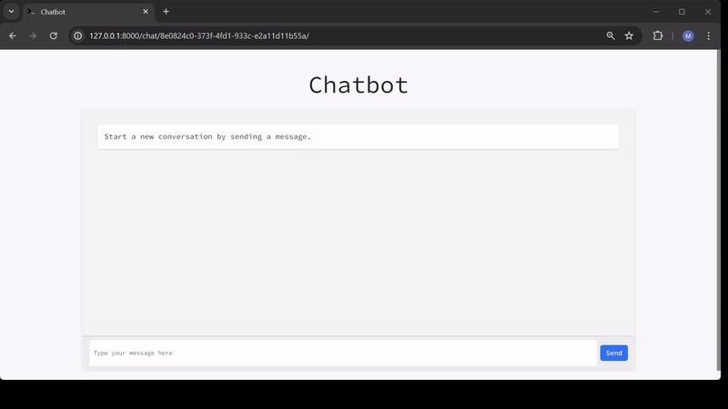

# Django OpenAI-Powered Chatbot with HTMX Streaming



While searching for an example of a Django-based chatbot powered by OpenAI and featuring asynchronous streaming, I found no suitable examples that incorporated HTMX and async. This prompted me to put together this repository.

### Key Features
* Asynchronous Streaming: This project leverages the HTMX websockets extension and Django's AsyncWebsocketConsumer to achieve real-time, streaming interactions with the chatbot.
* OpenAI Integration: Utilizes AsyncOpenAI for seamless communication with OpenAI's API, ensuring that the chatbot responses are both prompt and scalable.
* Conversation History: Enhances user experience by maintaining a history of interactions, allowing the chatbot to provide contextually relevant responses.

Can be adapted to work with open-source Large Language Models like Llama-3, provided that the HTTP client *handling communications with the LLM supports asynchronous operations.

## Notes about deploying to production

Because websockets requires ASGI instead of WSGI server, you should use something like Uvicorn: https://www.uvicorn.org/. I provided an example how to set this up in the `docker-compose.yml` file.

## Running the application locally:

- Create OpenAI api key at: https://platform.openai.com/ 
- Create `.env` file to the root directory. Example: `.env_example`

- Create your virtual environmennt and install dependencies:
```
pip install -r requirements.txt
```

- Run migrations and runserver
```
python manage.py migrate
python manage.py runserver
```

- Create a user for the application and start chatting.

## Running the application in docker-compose:

- Create OpenAI api key at: https://platform.openai.com/ 
- Create `.env` file to the root directory. Example: `.env_example``

```
docker-compose build
docker-compose up
```

The application is available at `http://127.0.0.1:8000`
